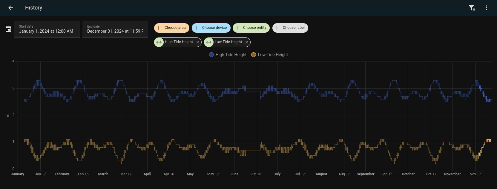

# metservice tides
Home Assistant integration using metservice (NZ) API to fetch Tides Data.

Provides the following:  
- (Current) High/Low Tide Height  
- (Current) High/Low Tide Time  
- (Next) High/Low Tide Height  
- (Next) High/Low Tide Time  
- Tide position  




## Installation

### Manual installation (i.e for HA Docker users)
- Clone the repo
- Copy `metservice_tides` directory into `home-assistant/config/custom_components/`
- Restart Home Assistant


## Use it
- Home Assistant -> Settings
- Devices & Services
- Add integration
- Search for `metservice tides`
- Follow the on-screen prompt to add it.

## Tips
### Setup Radial tides gauge


Prerequisite: Install [canvas-gauge-card](https://github.com/custom-cards/canvas-gauge-card)

```yaml
type: custom:canvas-gauge-card
entity: sensor.tide_radial_position
card_height: 250
gauge:
  animation: false
  type: radial-gauge
  title: Tide
  width: 220
  height: 220
  borderShadowWidth: 0
  borderOuterWidth: 0
  borderMiddleWidth: 0
  borderInnerWidth: 0
  minValue: 0
  maxValue: 100
  startAngle: 180
  ticksAngle: 360
  valueBox: false
  majorTicks:
    - High
    - Falling
    - Low
    - Rising
    - High
  minorTicks: 2
  strokeTicks: true
  borders: true
  highlights: []
```
